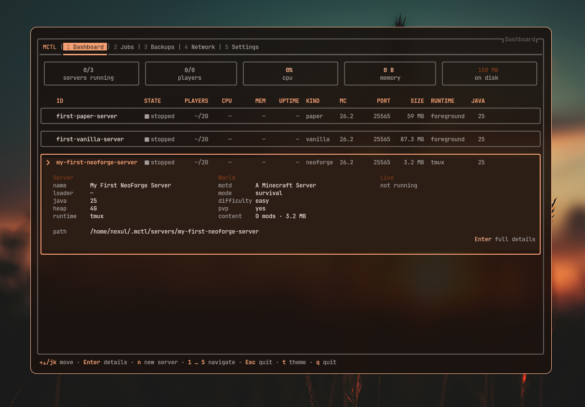

<div align="center">

```
███╗   ███╗ ██████╗████████╗██╗
████╗ ████║██╔════╝╚══██╔══╝██║
██╔████╔██║██║        ██║   ██║
██║╚██╔╝██║██║        ██║   ██║
██║ ╚═╝ ██║╚██████╗   ██║   ███████╗
╚═╝     ╚═╝ ╚═════╝   ╚═╝   ╚══════╝
```

**A terminal control plane for Minecraft servers.**

Create, install, launch, tunnel and watch your servers — from a full TUI *or* a scriptable CLI.
No daemon. No database. Just files.

[](https://bun.sh)
[](https://www.typescriptlang.org/)
[](https://github.com/sst/opentui)
[](#testing)
[](#roadmap)

<br>



</div>

---

## What it is

`mctl` reads like a native Unix utility — `systemctl`, `journalctl`, `podman` — and that is the point.
It is a **platform** for managing Minecraft servers, not a launcher. Everything Minecraft-specific lives
behind a provider interface, so adding a server type, a runtime, a tunnel or a backup target never means
touching the core.

Two front-ends sit on one core:

```
$ mctl                       # the interactive dashboard
$ mctl start survival        # the same thing, scriptable
```

Both go through identical services. Neither holds state.

---

## Highlights

| | |
|---|---|
| 🧊 **Stateless by design** | No daemon, no SQLite, no in-memory "running set". Every read re-derives from disk and live process probes. |
| 🪟 **Multi-instance** | Run the TUI in three terminals and a cron script beside them. They stay in sync through `fs.watch` + an append-only `events.jsonl` — no IPC, no leader. |
| 📦 **8 server kinds** | Paper, Vanilla, Fabric, Forge, NeoForge, Quilt, Purpur, Velocity — each with its real install shape (runnable jar, loader jar, or an installer that must be *executed*). |
| ☕ **Java, resolved not guessed** | The required major version comes from the upstream APIs, picks the best installed JDK, and downloads Temurin when there isn't one. Pins are honoured forever. |
| 🌍 **Networking as a subsystem** | Direct (LAN + public address), `cloudflared`, `playit`, `ngrok`, `tailscale`, plus Cloudflare DNS with `_minecraft._tcp` SRV records so players join a bare domain. |
| 🖥️ **Detached runtimes** | tmux sessions outlive the TUI. Close it, reopen it tomorrow, and `mctl` re-discovers and re-attaches by probing. |
| 🎨 **Themed and adaptive** | Light/dark schemes, built-in GitHub & Nord, live-reloading `~/.config/mctl/themes/*.json`, and a theme derived from *your terminal's* palette. Icons degrade Nerd → Unicode → ASCII. |
| 🧑 **Real player heads** | Skins fetched from Mojang (then TLauncher, then Ely.by), decoded by a hand-rolled PNG reader, and drawn as 8×8 faces in the terminal. |
| 🧾 **ANSI-aware console** | Modded servers' log4j colour output renders as colour, not as `[32m`. |
| 🔒 **Your worlds are safe** | MCTL writes exactly one file into a server directory: `mctl.json`. Deletion is always explicit and staged. |

---

## Quick start

Requires [Bun](https://bun.sh). `tmux` is optional but recommended; tunnel binaries are discovered on
`PATH` and never downloaded.

```bash
git clone git@github.com:nexuls/mctl-js.git
cd mctl-js
bun install

# first run — writes ~/.config/mctl/config.json and the data tree
bun run src/index.tsx init

# launch the dashboard
bun run src/index.tsx
```

Give yourself the real command:

```bash
alias mctl="bun run $PWD/src/index.tsx"
```

Then:

```bash
mctl create Survival --kind paper --mc 1.21.4 --memory 4G --runtime tmux --eula
mctl start survival
mctl logs survival -f
mctl network status survival     # join address, tunnel, DNS
mctl stop survival
```

Running `mctl` with no arguments opens the TUI instead. Everything the TUI does, the CLI does.

---

## The TUI

The **Dashboard** — pictured above — is both the summary and the fleet list: five live tiles across the
top (servers running · players · cpu · memory · on disk), then every server as a bordered row carrying
its state, players, cpu, memory, uptime, kind, MC version, port, size, runtime and Java. `Enter`
expands a row in place into **Server · World · Live** columns without leaving the page.

Digits `1`–`5` jump to Dashboard, Jobs, Backups, Network and Settings from anywhere. `↑↓`/`jk` move,
`n` creates a server, `t` cycles the theme.

A server opens into a tabbed page — **Overview · Console · Players · World · Content · Performance ·
Network · Backups · Settings** — with an ANSI-rendered live console, a per-player card (real skin
head, playtime, position, health & food meters, moderation actions), and per-server network state.

Keyboard throughout: Tab rings skip disabled controls, modals own the keyboard while open, and the
hint strip along the bottom is contributed to by whatever is on screen.

---

## CLI reference

```
mctl                       launch the interactive dashboard (TUI)
mctl <command> [..]        run one command and exit (scriptable)

  init                     first-run setup, headless (same fields as the wizard)
  list                     every server with its probed state
  status <id>              one server, verbose
  create <name>            create and install a new server
  edit <id>                change a server's settings
  delete <id>              remove a server (--files to erase its directory)
  start | stop | restart <id>
  logs <id> [-f]           stream the console
  exec <id> <cmd...>       send a command to a running server
  java list | install <major>
  network [up|down|status] join addresses, tunnels, DNS

  --json                   machine-readable output on any command
```

`--json` emits the same view model the TUI renders, so scripts and screens can never disagree.

---

## How it works

```
        ┌───────────────────────┐   ┌───────────────────────┐
        │   OpenTUI (React) UI  │   │      One-shot CLI     │
        └───────────┬───────────┘   └───────────┬───────────┘
                    │      hooks / commands     │
                    └────────────┬──────────────┘
                                 ▼
                    ┌─────────────────────────┐
                    │     MCTL Core Engine    │   no authoritative in-memory state
                    └────────────┬────────────┘
                                 ▼
                          Provider interfaces
                                 ▼
      Server providers · Runtimes · Network providers · (Backups)
                                 ▼
            lib/  fs · shell · http · download · paths · watch · logger
```

Dependencies point **inward only**. A page never spawns a process; the core never imports a concrete
provider; `lib/` has never heard of Minecraft.

**The filesystem is the source of truth.** A server's `mctl.json` is authoritative for its config;
mods, players, port, MOTD and state are derived from disk or a live probe at display time.

```
~/.config/mctl/        config.json · secrets.json (0600) · themes/ · keybindings.json
~/.cache/mctl/         upstream manifests (ETag) · skins — safe to delete at any time
~/.local/state/mctl/   servers.json (locations only) · events.jsonl · runtime/<id>.json
$ROOT/                 servers/ · backups/ · java/ · downloads/
```

The one state file that references servers is a **pointer index**: `id → path`, never contents. Servers
may live on any drive; an unmounted one is marked *unavailable*, never deleted.

<details>
<summary><b>Project layout</b></summary>

```
src/
  index.tsx        argv dispatch → TUI or one-shot CLI
  app/             the OpenTUI pages (Dashboard, Server, Network, Settings, setup wizard)
  components/      pure UI kit: Table, Form, Tabs, Dialog, Toast, ProgressBar, MinecraftHead…
  hooks/           the only bridge between the TUI and core
  cli/             router + commands + table/JSON formatting
  core/            config · registry · session · events · jobs · server · java · runtime · network
  providers/       server/ (8) · runtime/ (foreground, tmux) · network/ (5)
  lib/             leaf helpers over Bun/Node — no domain knowledge
  types/           Zod schemas; every external boundary is validated
```

</details>

---

## Testing

```bash
bun test           # 421 tests, 43 files
bun run typecheck  # tsc --noEmit
bun run format     # Biome
```

Tests drive **real** things wherever it matters: rendered OpenTUI frames with synthetic keypresses,
real detached agent processes, a local stand-in Cloudflare API, a range-honouring HTTP server for
resume, and installer jars stubbed by real shell scripts. Provider tests never hit the live network on
a default run.

---

## Roadmap

| Phase | | |
|---|---|---|
| 1 | Foundation — paths, config, registry, sessions, events, shell, CLI dispatch | ✅ |
| 2 | Server lifecycle — Vanilla/Paper, Java resolution, foreground runtime, create/delete | ✅ |
| 3 | Loaders & installers — Fabric, Quilt, Forge, NeoForge, Purpur, Velocity, tmux, staged installs | ✅ |
| 4 | Networking ✅ · Cloudflare DNS ✅ · backups & supervision ⏳ | 🚧 |
| 5 | Docker runtime · Modrinth & CurseForge · RCON · always-on agent · REST API · plugin protocol | ⏳ |

---

## Contributing

Read [`AGENTS.md`](AGENTS.md) first — it is the working agreement, and it is short. In brief: the
layering is non-negotiable, every export gets a doc comment explaining *why*, all external data is
validated with Zod, and the four files in [`artifacts/`](artifacts/) carry the project's memory across
sessions. Format with `bun run format` before committing.

<div align="center">
<sub>Built with <a href="https://bun.sh">Bun</a>, <a href="https://github.com/sst/opentui">OpenTUI</a> and React 19.</sub>
</div>
